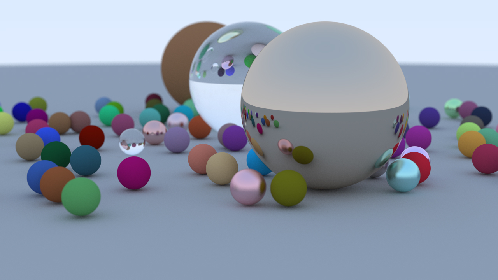

# RayTracer

&nbsp;&nbsp;&nbsp;&nbsp;In 3D computer graphics, ray tracing is a rendering technique for generating an image by tracing the path of light as pixels in an image plane and simulating the effects of its encounters with virtual objects.

The technique is capable of producing a high degree of visual realism, more so than typical scanline rendering methods, but at a greater computational cost.

-- <cite>https://en.wikipedia.org/wiki/Ray_tracing_(graphics)

## Project 
&nbsp;&nbsp;&nbsp;&nbsp;My application is a ray tracer program that generates an image of spheres of varying materials. 
I used the concept of recursion in sampling each pixel from each ray cast. 
Basic polymorphism was used in creating materials and shapes. This allowed the calling of virtual functions when testing ray intersections and material appearance.
Multithreading is used to calculate intersections, as well as, the scattering of light function for each pixel.
Eventually this can be moved to the GPU for even faster acceleration.

## Result
   

## Building and Running

Tested with Windows using:

  - CMake GUI
  - Visual studio 2019
  - C++ 17

&nbsp;&nbsp;&nbsp;&nbsp;&nbsp;&nbsp;&nbsp;&nbsp;Make a build directory.

&nbsp;&nbsp;&nbsp;&nbsp;&nbsp;&nbsp;&nbsp;&nbsp;cmake GUI - Specify 2019 as the compiler. Configure and generate solution files.

&nbsp;&nbsp;&nbsp;&nbsp;&nbsp;&nbsp;&nbsp;&nbsp;Open in visual studio 2019. Build and run.

Image will be rendered and saved where the exe is located.

Tested with Linux using:

- CMake
- Visual studio code
- GCC 9
- C++ 17

&nbsp;&nbsp;&nbsp;&nbsp;&nbsp;&nbsp;&nbsp;&nbsp;mkdir build

&nbsp;&nbsp;&nbsp;&nbsp;&nbsp;&nbsp;&nbsp;&nbsp;cd build

&nbsp;&nbsp;&nbsp;&nbsp;&nbsp;&nbsp;&nbsp;&nbsp;cmake ..

&nbsp;&nbsp;&nbsp;&nbsp;&nbsp;&nbsp;&nbsp;&nbsp;make

&nbsp;&nbsp;&nbsp;&nbsp;&nbsp;&nbsp;&nbsp;&nbsp;./RayTracer

Image will be rendered and saved in the build folder.
